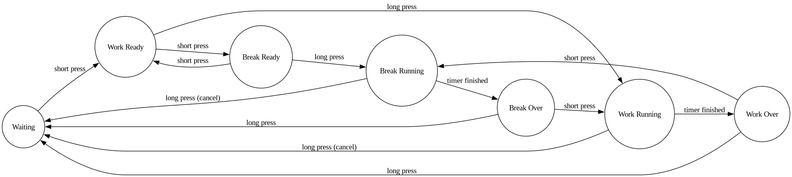

# YD-RP2040-based Tomato Timer

A minimalist timer for the [Pomodoro Technique](https.en.wikipedia.org/wiki/Pomodoro_Technique).

Click on the image below to watch the demo on youtube.

[](https://www.youtube.com/watch?v=5J5LkFbHoXA)

I haven't had this much fun developing this little thing in a long time!

Building a little standalone device that can sit on my desk and track my work time has been on my bucket list for a while, so I'm incredibly happy I've finally done it.
Being able to run MicroPython on this chip is a blessing.

## How to Use the Timer

I recommend watching the video above to get an overview of the functionality.

- **Initial State (Waiting):** The device starts in a "waiting" state, with the LED slowly cycling through different colors. 
- **Short Press:** A short press of the button moves the device to the "Work Ready" state, indicated by a breathing blue light.
- **From "Work Ready":**
    - Another short press will cycle to the "Break Ready" state, indicated by a breathing green light.
    - A long press will start the 25-minute work timer.
- **From "Break Ready":**
    - A short press will cycle back to the "Work Ready" state (breathing blue).
    - A long press will start the 5-minute break timer.
- **During a Timer (Work or Break):**
    - A long press will cancel the timer and return to the "Waiting" state.
    - The LED color will slowly transition from the green to red.
      - Green indicate that the timer started recently. 
      - Red tells that the time is finishing.
    - a little blue led will be turned on while a work timer is running to allow you distinguish the timers.
- **Timer Over:**
    - When a timer finishes, the LED will blink red. 
    - From here, a short press will take you to the next logical state (e.g., after work, to break; after break, to work).
    - A long press will return to the "Waiting" state.



## Make your own.
If you want to build your own timer based on the YD-RP2040 board you can follow the following instructions

### Flashing MicroPython

1.  **Download MicroPython Firmware:**
    Go to the [MicroPython downloads page](https://micropython.org/download/RPI_PICO/) and download the latest stable firmware for the "Raspberry Pi Pico". The file will have a `.uf2` extension.

2.  **Enter Bootloader Mode:**
    - Connect the YD-RP2040 board to your computer via USB while holding down the `BOOTSEL` button.
    - The board will mount as a USB mass storage device named `RPI-RP2`.

3.  **Flash the Firmware:**
    - Drag and drop the downloaded `.uf2` file onto the `RPI-RP2` drive.
    - The board will automatically reboot, and the `RPI-RP2` drive will disappear. MicroPython is now installed.

### Loading the Python Files

To copy the Python files from this repository to the device, you can use a tool like `rpremote`.

1.  **Install rpremote:**
    You can install `rpremote` using `pip`:
    ```bash
    pip install rpremote
    ```

2.  **Copy the Files:**
    `rpremote` allows you to copy files to the device. Use the `cp` command to copy all the files from the `src` directory to the root of the device's filesystem:
    ```bash
    rpremote cp src/*.py :
    ```

3.  **Run the Code:**
    The `main.py` file will be executed automatically on boot. You can also manually start it from the REPL for debugging.

Now your YD-RP2040 is a fully functional Pomodoro timer!

## Implementation Notes

This device has to be able to do multiple things at the same time:
 - Keep an eye on the button to detect when it gets pressed.
 - Keep track of the time passed.
 - Change the LED color to indicate the different statuses.

There are a few options to achieve multitasking on microcontrollers.

Often, interrupts based on timers or other sources are used to momentarily interrupt the program execution and run some other piece of logic.

MicroPython allows binding some methods/functions to interrupts too, and it also supports [asyncio](https.docs.micropython.org/en/latest/library/asyncio.html).

In the first release I've written my own event loop but I've refactored the whole codebase to use asyncio insted.
